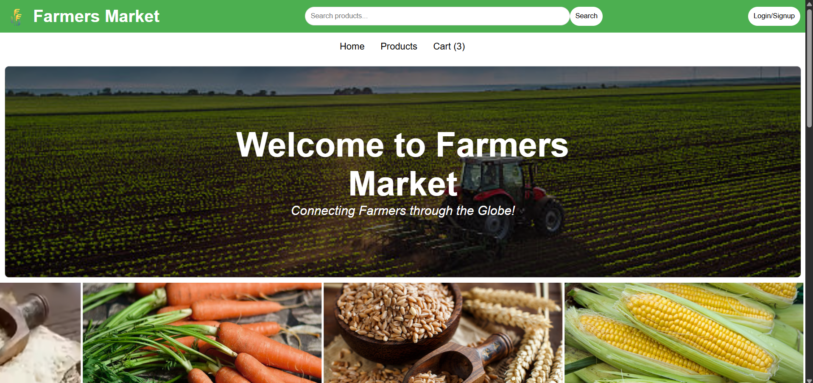
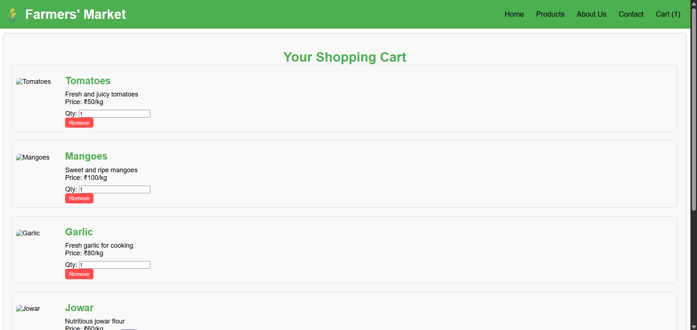
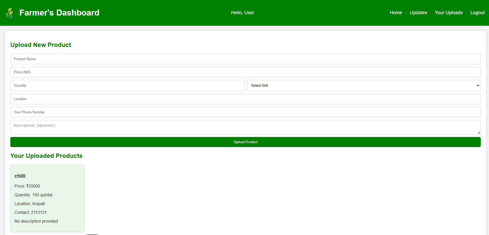

# 🌾 Farm2Home - Farmers Market Website

Farm2Home is a responsive farmers market website where users can explore fresh farm products, view policies, contact farmers, and manage their cart.  
This project is built using **HTML**, **CSS**, and **JavaScript**.

---

## 📂 Project Structure

Farm2Home/
│── about.html # About Us page
│── cart.html # Shopping cart page
│── contact.html # Contact page
│── FAQ.html # Frequently Asked Questions
│── farmers-dashboard.html # Farmers' dashboard page
│── index.html # Home page
│── login.html # Login page
│── privacy-policy.html # Privacy Policy
│── registration.html # User registration page
│── shipping-delivery-policy.html # Shipping & Delivery Policy
│── terms-and-services.html # Terms & Services
│── script.js # Main JavaScript file
│── styles.css # Main stylesheet

---

## 🚀 Features

- **Responsive Design** – Works on desktops, tablets, and mobile devices.
- **User Registration & Login** – Simple user authentication interface.
- **Shopping Cart** – Add and view selected items.
- **Farmer Dashboard** – Farmers can manage their product listings.
- **Policy Pages** – Privacy, Terms & Conditions, Shipping & Delivery.
- **Contact & FAQ** – Easy communication and information access.

---

## 🛠 Technologies Used

- **HTML5** – Semantic and accessible markup.
- **CSS3** – Custom styles for layout and design.
- **JavaScript (ES6)** – Interactivity and dynamic behavior.

---

## 📸 Screenshots

### 🏠 Homepage

### 🛒 Cart Page

### 📊 Farmer Dashboard

